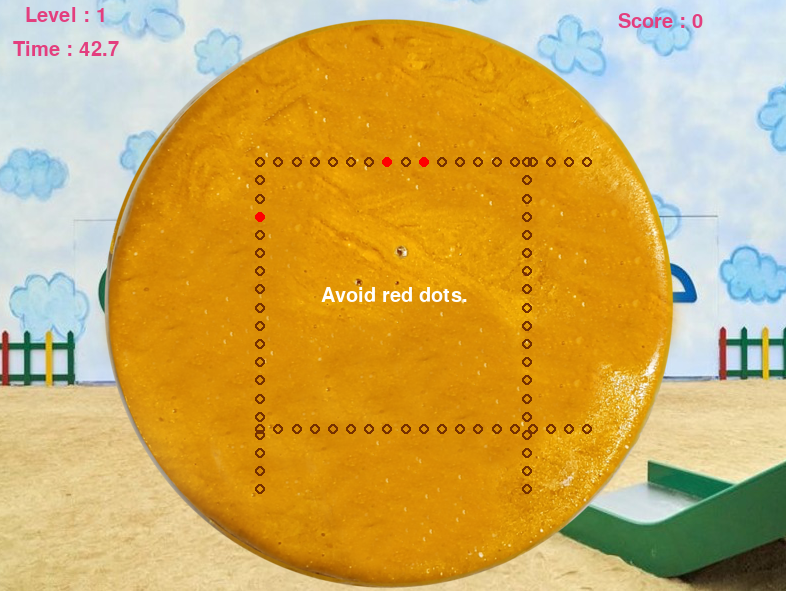
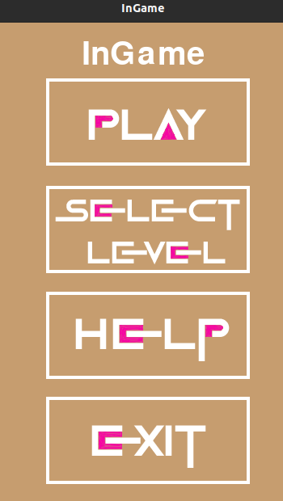
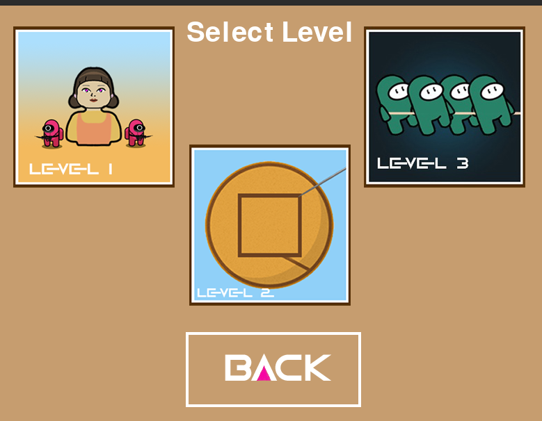
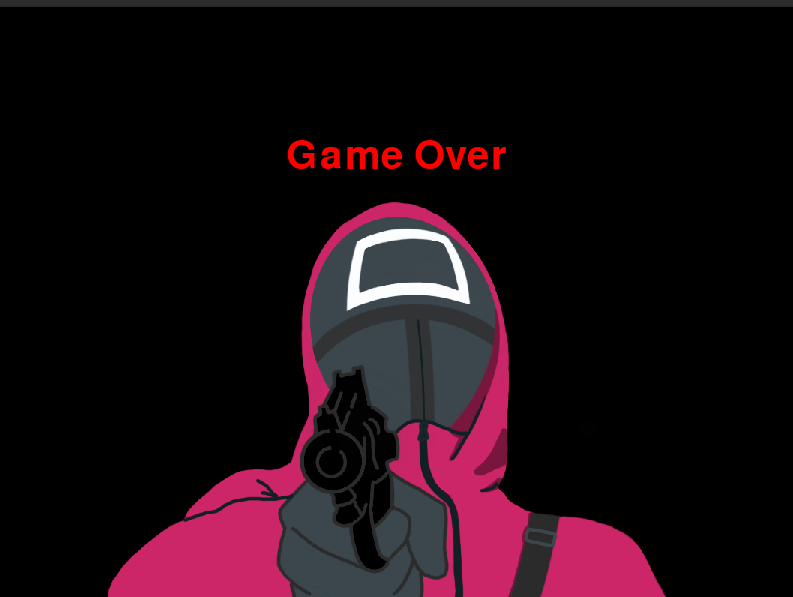

# Семестровый проект по курсу «Совместная разработка приложений на Python»

## Оглавление
1. [Постановка задачи](#introduction)
2. [Интерфейсная модель приложения](#paragraph1)
    1. [Реализованные базовые пункты](#subparagraph21)
	2. [Игровая инструкция](#subparagraph22)
	3. [Разработанный интерфейс игры](#subparagraph23)
3. [InGame Wiki](https://github.com/juliazadorozhnaya/InGame/wiki)

## Постановка задачи 
- Написать игру InGame по мотивам сериала Squid Game
- В качестве фреймворка планируется использовать [PyGame](https://pypi.org/project/pygame/)

## Интерфейсная модель приложения 
- Пример одной из трех мини-игры InGame:

### Реализованные базовые пункты 
* Реализация 3 различных мини-игр с игровыми объектами из сериала:
* Отображение всех игровых элементов разными изображениями. 
* Реализация движения и взаимодействия с окружением игрока при помощи стрелок на клавиатуре. 
* Релизация взаимодействия динамическими и статическими NPC-игроками.
* Если заканчивается время, отведенное на мини-игру, то выводится сообщение о проигрыше.
* Если игрок прошел в тренировочном режиме одну из мини-игр, необходимо вывести сообщение об успешном окончании игры и набранные очки.
* Если игрок прошел в режиме выживания на время все три мини-игры, необходимо вывести сообщение об успешном окончании игры и набранные очки.
* Базовый экран загрузки:
  * Выбор режима игры;
  * Инструкция к мини-играм;
  * Выход из игры.

### Игровая инструкция 
Твоя цель - выжить!

* В первой игре RedLight_GreenLight необходимо не попасться на прицел развернутой кукле, а также не наткнуть на движущихся охранников. Цель: коснуться развернутой куклы!
* Во второй игре CookieCutter нужно аккуратно по очертаниям вырезать фигуру на печеньке, используя игру. Цель: не наткнуться на красные точки при вырезании, иначе вся печенька сломается
* В третье игре CookieCutter необходимо выиграть перетягивание каната, используя быстрое нажатие таких клавиш, как Space и ➡. 
Цель: уложиться во время, перетянуть канат и не упасть вниз! 

### Разработанный интерфейс игры 
1. Пример Стартового меню:

2. Примеры Игрового экрана:

3. Примеры Финального экрана:

Экран Поражения:

